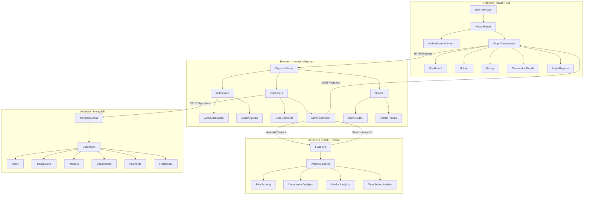
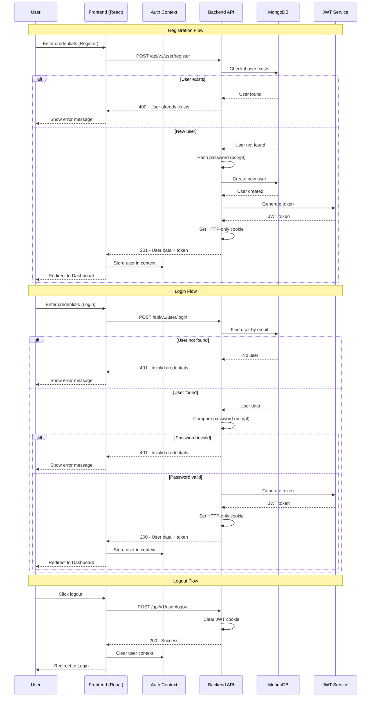
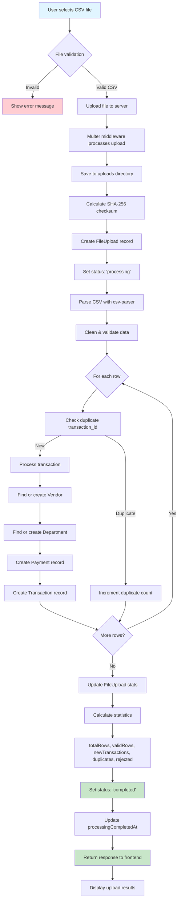
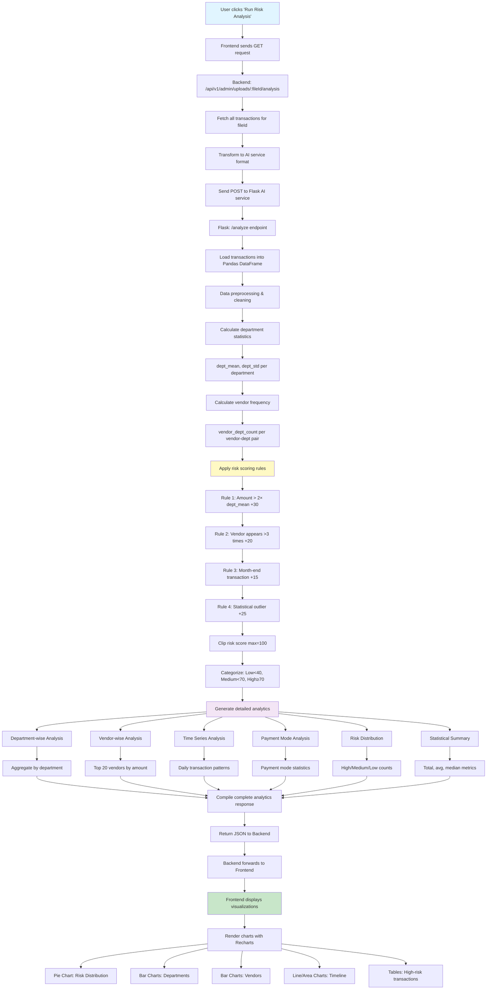
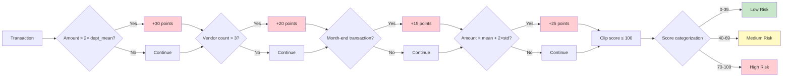
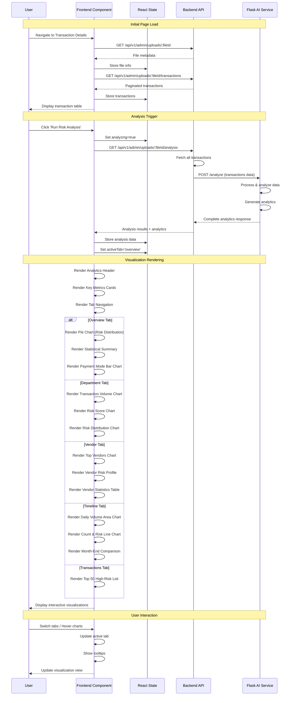
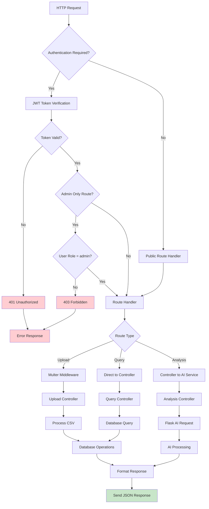
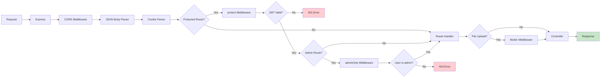
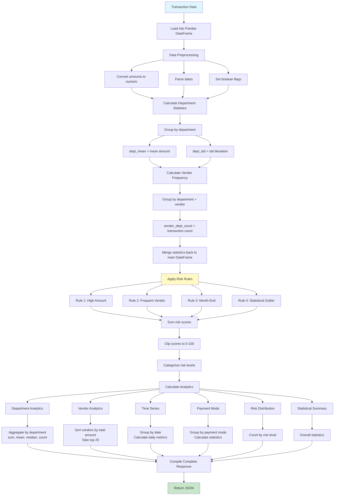

# SmartGov.AI - Complete System Workflow Documentation

This document provides comprehensive workflow diagrams for all major processes in the SmartGov.AI government audit analytics platform.

## Table of Contents
1. [System Architecture](#system-architecture)
2. [User Authentication Flow](#user-authentication-flow)
3. [CSV Upload & Processing Flow](#csv-upload--processing-flow)
4. [Risk Analysis Flow](#risk-analysis-flow)
5. [Data Visualization Flow](#data-visualization-flow)
7. [API Request Flow](#api-request-flow)

---

## System Architecture

---

## User Authentication Flow

---

## CSV Upload & Processing Flow

---

## Risk Analysis Flow

### Risk Scoring Algorithm Detail

---

## Data Visualization Flow

---

## API Request Flow

### Middleware Chain

---

## Analytics Calculation Flow

