# SmartGov.AI - Complete System Workflow Documentation

This document provides comprehensive workflow diagrams for all major processes in the SmartGov.AI government audit analytics platform.

## Table of Contents
1. [System Architecture](#system-architecture)
2. [User Authentication Flow](#user-authentication-flow)
3. [CSV Upload & Processing Flow](#csv-upload--processing-flow)
4. [Risk Analysis Flow](#risk-analysis-flow)
5. [Data Visualization Flow](#data-visualization-flow)
6. [Database Schema Relationships](#database-schema-relationships)
7. [API Request Flow](#api-request-flow)
8. [Frontend Navigation Flow](#frontend-navigation-flow)

---

## System Architecture

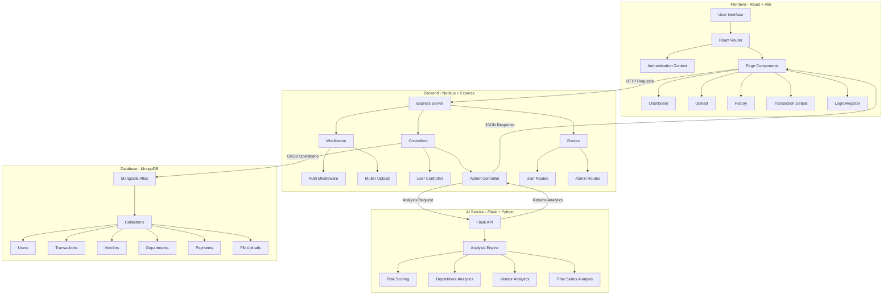

---

## User Authentication Flow

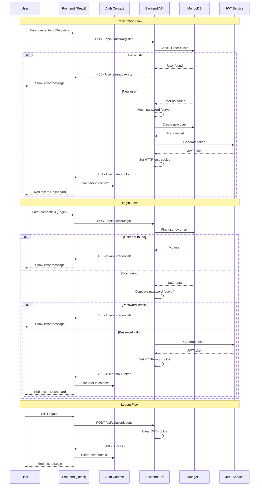

---

## CSV Upload & Processing Flow

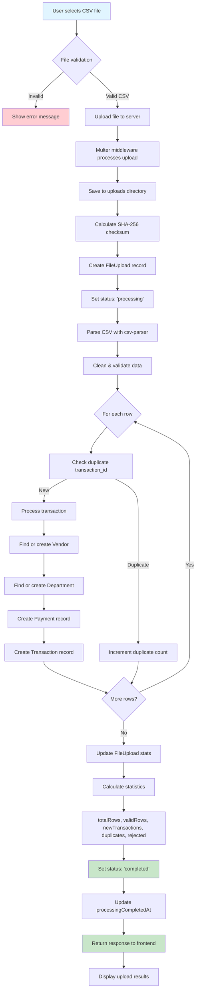

### Detailed CSV Processing Steps

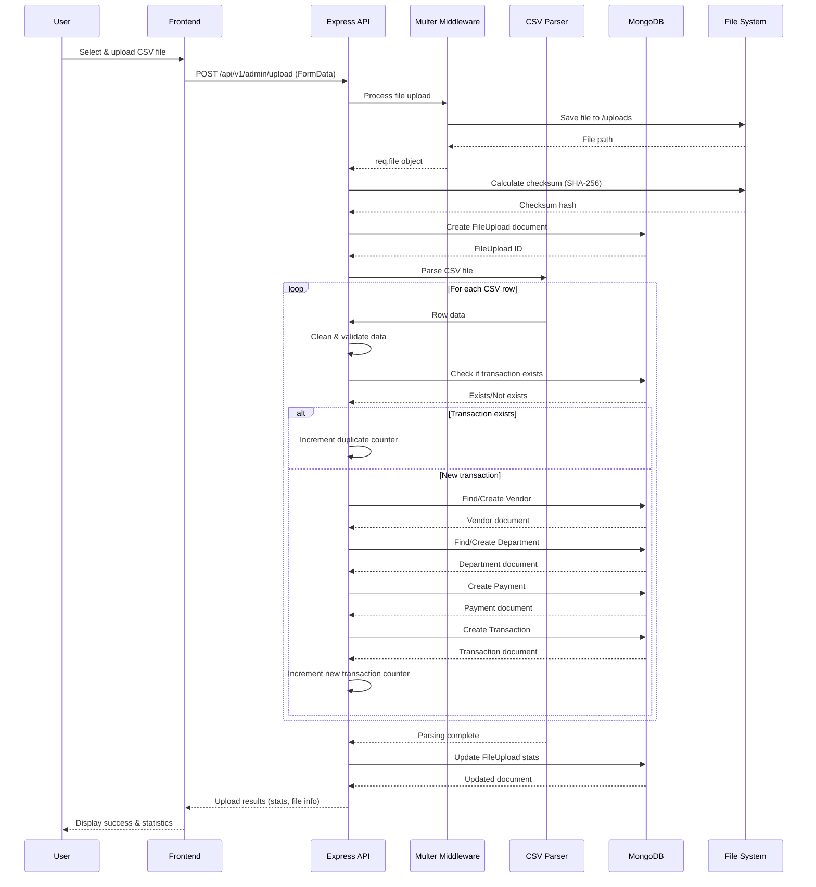

---

## Risk Analysis Flow

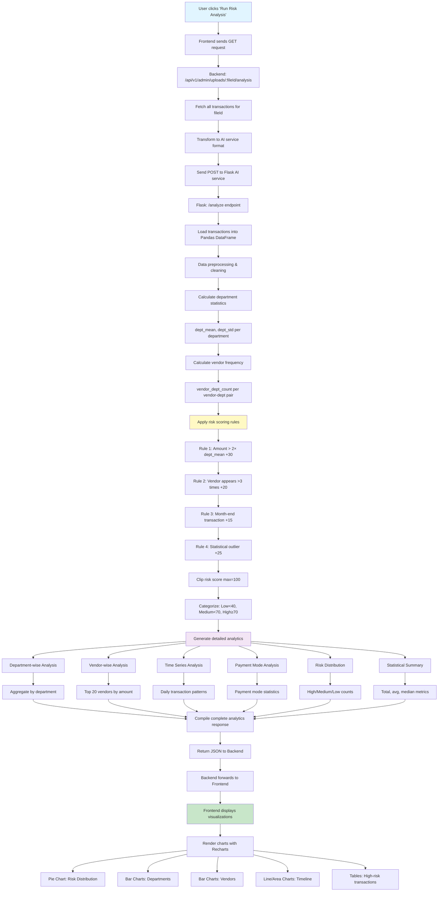

### Risk Scoring Algorithm Detail

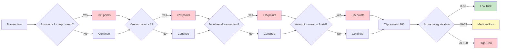

---

## Data Visualization Flow

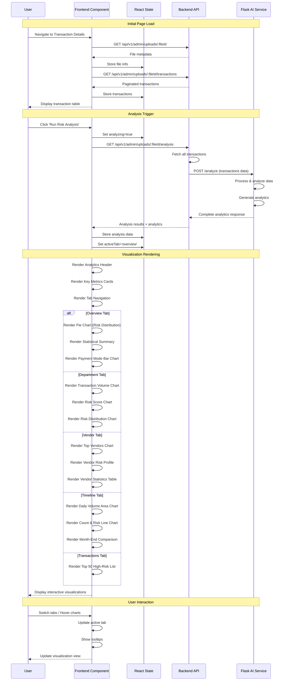

---

## Database Schema Relationships

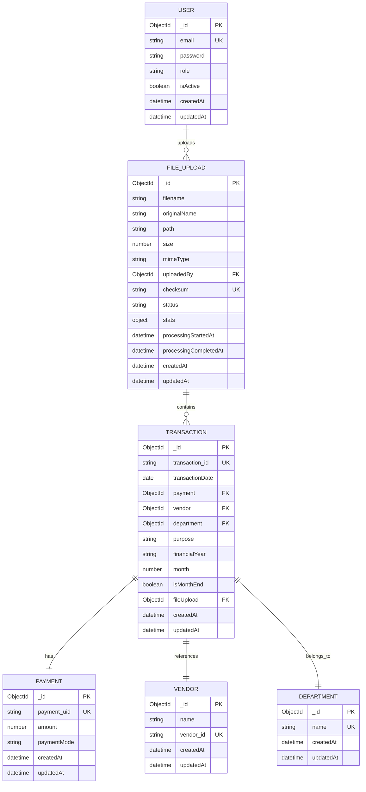

---

## API Request Flow

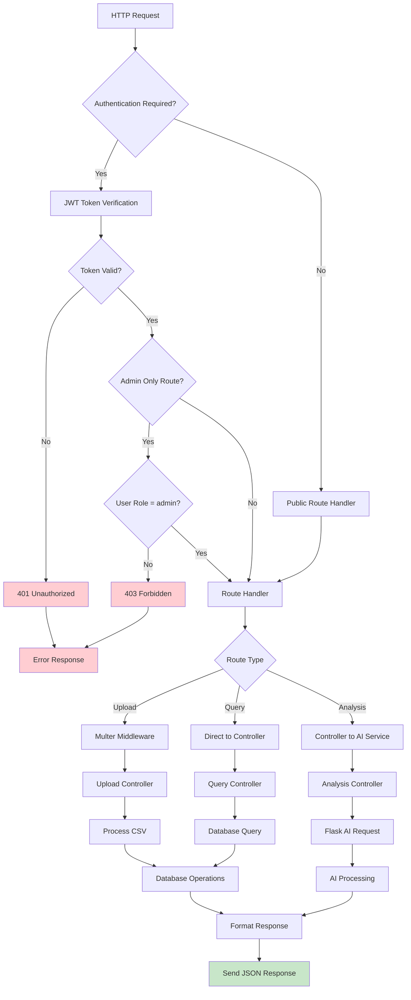

### Middleware Chain

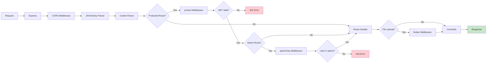

---

## Frontend Navigation Flow

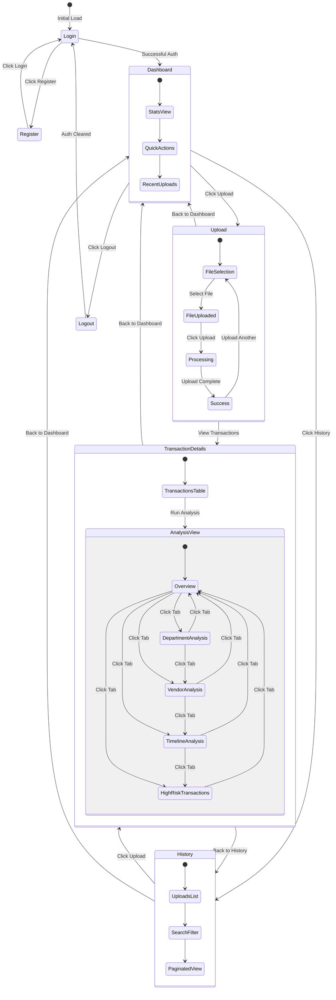

---

## Complete End-to-End Flow

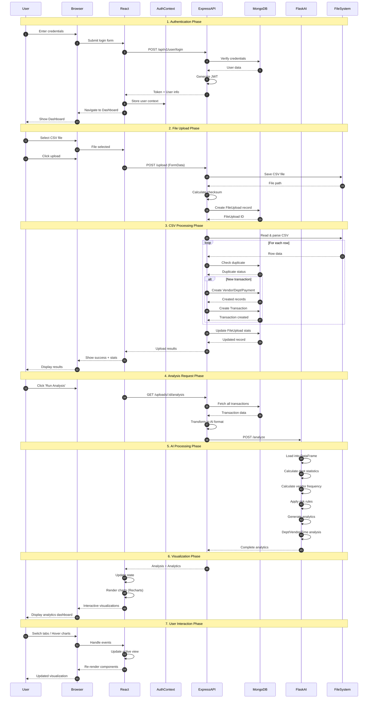

---

## Technology Stack Flow

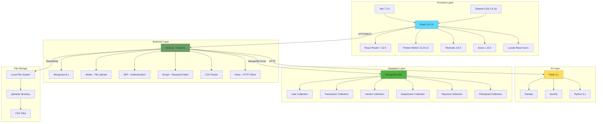

---

## Error Handling Flow

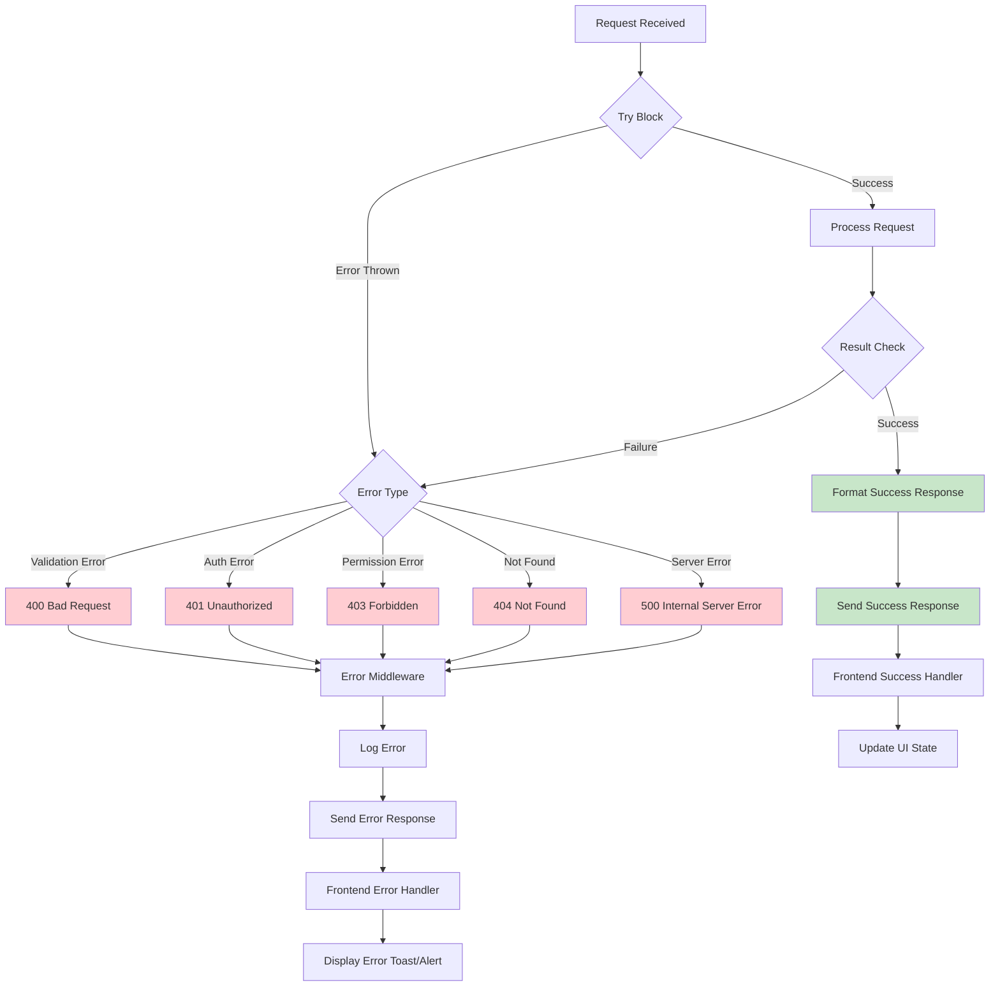

---

## Performance Optimization Flow

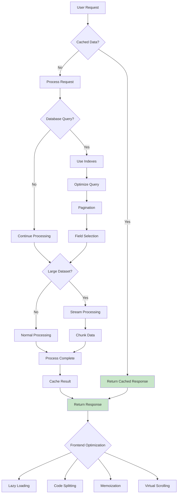

---

## Deployment Architecture

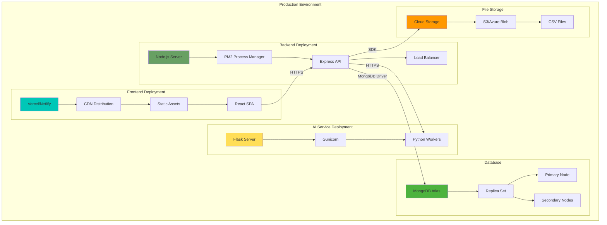

---

## Security Flow

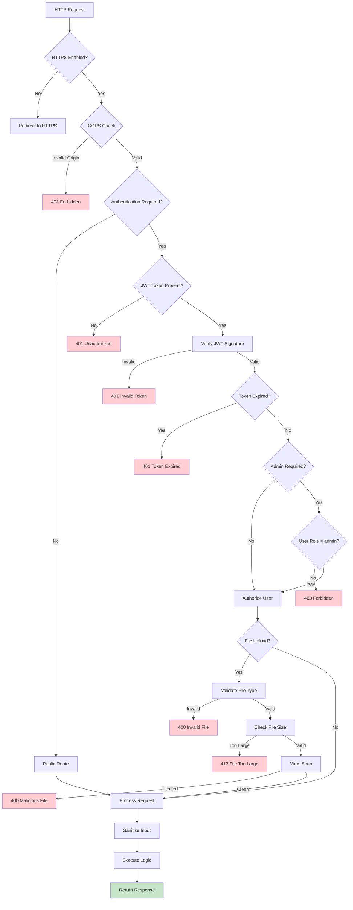

---

## Analytics Calculation Flow

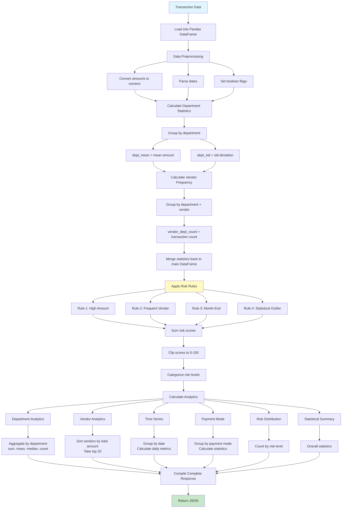

---

## Monitoring & Logging Flow

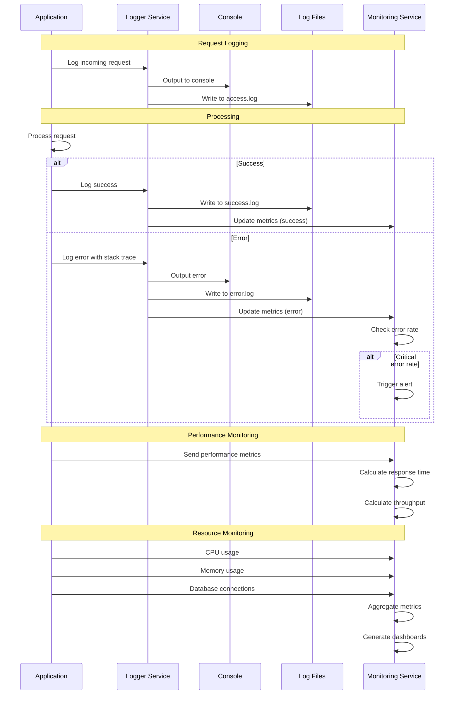

---

## Future Enhancements Flow

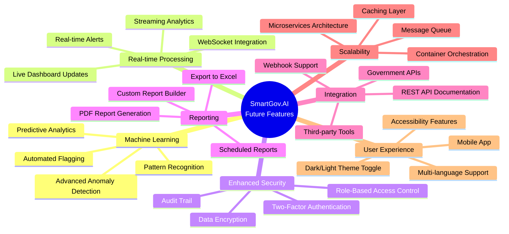

---

## Summary

This workflow documentation provides a comprehensive view of the SmartGov.AI platform's architecture, data flows, and operational processes. The system is designed with:

- **Security-first approach**: JWT authentication, role-based access control, and data validation
- **Scalable architecture**: Modular design with separate frontend, backend, and AI services
- **Robust error handling**: Comprehensive error checking and graceful failure recovery
- **Performance optimization**: Pagination, caching, and efficient database queries
- **User-centric design**: Intuitive UI with interactive visualizations and clear feedback

The platform successfully combines modern web technologies (React, Node.js, Flask) with advanced analytics to provide government auditors with powerful tools for detecting financial anomalies and generating actionable insights.
